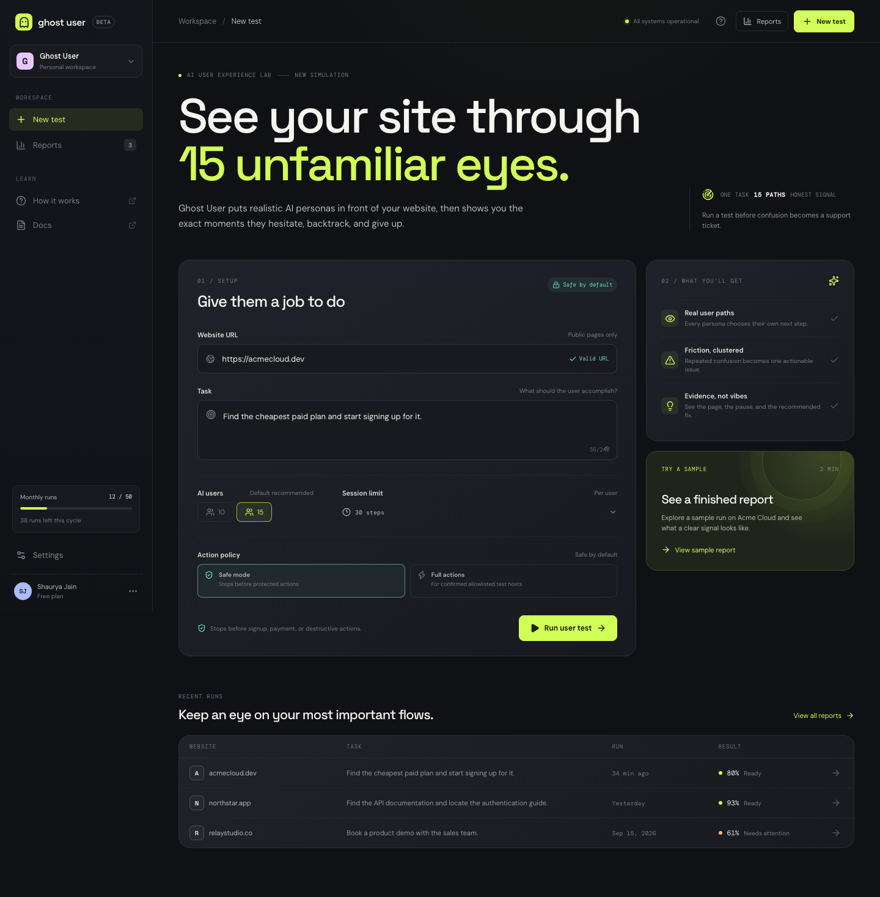
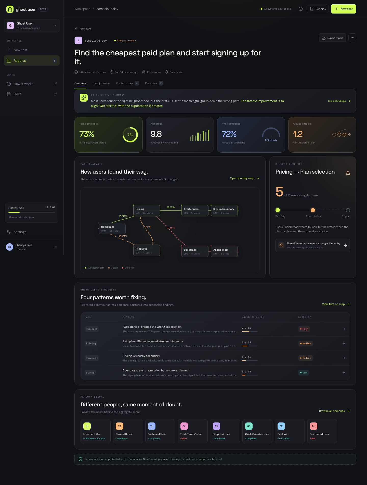
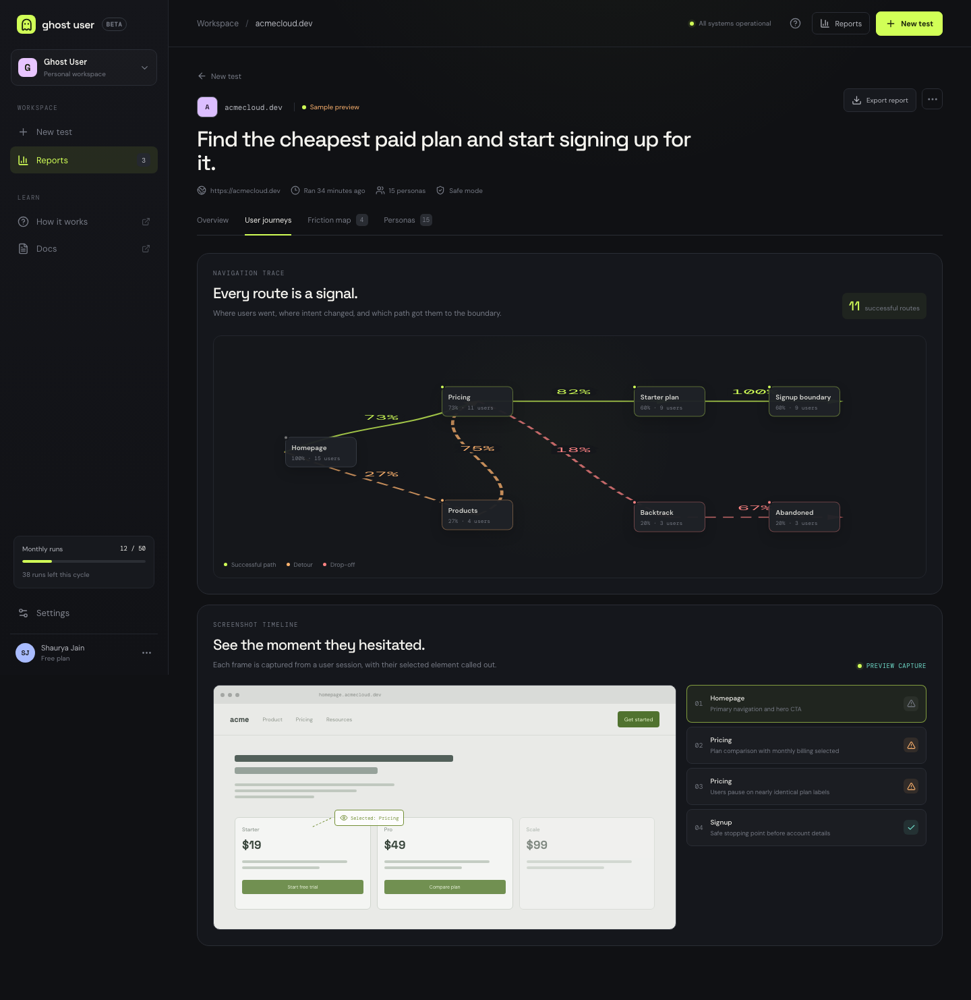
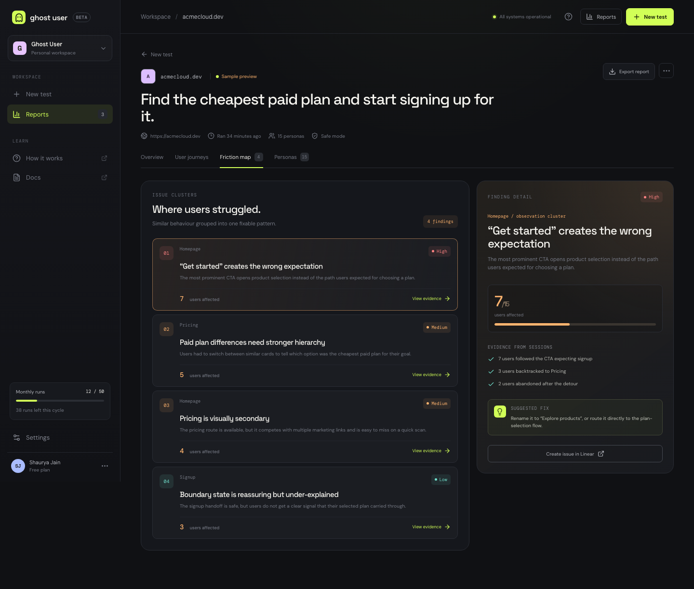
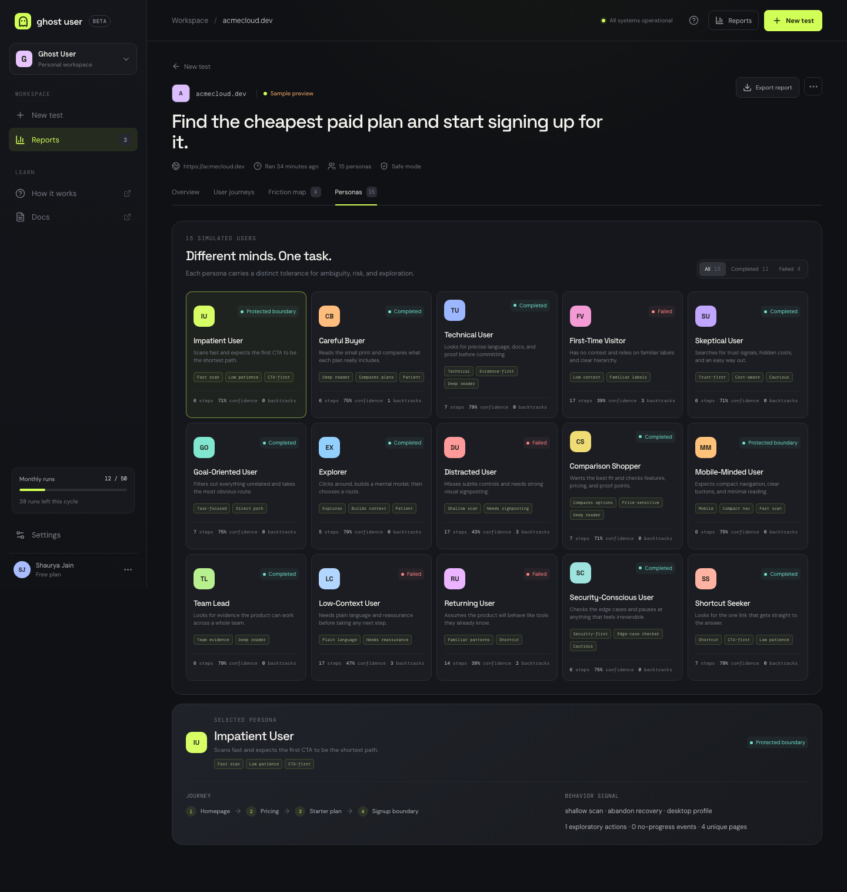

# Ghost User

> AI UX testing through unfamiliar eyes.

Ghost User is a full-stack AI UX simulation workspace. Give it a public website and a task, then watch a panel of simulated users navigate the experience in isolated browser sessions. The resulting report shows where people hesitate, backtrack, lose confidence, or stop—and turns repeated behavior into actionable friction findings.

The app is designed around one idea: a happy-path walkthrough is not enough. A site should also make sense to people who arrive with different levels of patience, technical knowledge, risk tolerance, attention, and willingness to explore.



## What it does

Ghost User takes one outcome-oriented task, such as:

> Find the cheapest paid plan and start signing up for it.

It then:

1. Creates independent persona contexts with different behavioral profiles.
2. Opens the target website in isolated Playwright browser sessions.
3. Gives JEV a compact, structured view of the current page and asks for one typed next action.
4. Validates that action against the current page and the selected action policy.
5. Captures the route, action, confidence, timing, and screenshot evidence.
6. Aggregates the sessions into a report with metrics, journey paths, friction clusters, and persona-level detail.

The app includes a fixture-backed sample report, so the product can be explored without opening an external website or configuring an API key.

## Product tour

### 1. Configure one task

The New test screen keeps the input intentionally small:

- **Website URL** — the public site to inspect.
- **Task** — what the simulated user should accomplish. Write the desired outcome, not a list of clicks.
- **AI users** — 10 or 15 simulated users in the current UI. The API accepts between 5 and 15.
- **Session limit** — the maximum number of steps per user; the UI defaults to 30 and the API accepts 10–50.
- **Action policy** — Safe mode is the default. Full actions are an explicit, allowlisted opt-in.

The sample task is prefilled so the flow is immediately discoverable.

### 2. Read the report overview



The overview combines the most important signals in one place:

- **Task completion** — the share of personas that completed the requested outcome or reached a safe stopping boundary.
- **Average steps** — how much interaction the route required, split between successful and failed paths.
- **Average confidence** — confidence across JEV decisions in the run.
- **Average backtracks** — how often users had to recover or revisit a route.
- **Path analysis** — the common route through the task and the main detours.
- **Biggest drop-off** — the point where the largest group lost momentum.
- **Friction clusters** — repeated behavior grouped into findings with evidence and a suggested fix.
- **Persona signal** — a compact view of the individual users behind the aggregate score.

### 3. Trace user journeys



The User journeys tab shows routes as a graph. Green paths represent successful progress, orange paths represent detours, and red paths represent drop-off. Each node includes the share and count of users that reached it.

The screenshot timeline below the map links the route to visual evidence. In a live run, frames come from the browser session. In the sample report, the UI renders a preview capture that still demonstrates the selected-element callout and the sequence of user decisions.

### 4. Turn repeated confusion into findings



The Friction map groups similar observations into a small set of fixable patterns. Selecting a finding shows:

- the affected page and severity;
- the number of users affected;
- evidence collected across sessions;
- a suggested product or content change.

This keeps the report focused on patterns that repeat across users rather than isolated, anecdotal clicks.

### 5. Compare the simulated personalities



The Personas tab exposes the users behind the aggregate metrics. Each card includes the persona's description, behavioral labels, outcome, step count, confidence, and backtracks. Selecting a persona reveals its path and behavior signal, including scan depth, recovery style, device profile, exploration, and no-progress events.

## How personas work

Ghost User uses “persona” to mean a simulated personality with two layers:

1. **Human-readable traits** describe what kind of user this is.
2. **Execution behavior** turns those traits into observable browsing patterns.

### Trait layer

Every persona has normalized values that are passed into the JEV decision context:

| Trait | What it represents | Typical effect |
| --- | --- | --- |
| `patience` | Tolerance for a slow or ambiguous route | Helps determine how much route budget the user receives |
| `technicalLiteracy` | Comfort with technical language and concepts | Makes documentation, API, SDK, and security signals more relevant |
| `riskTolerance` | Willingness to continue when a step feels consequential | Shapes how readily the user proceeds toward a boundary |
| `attentionToDetail` | How much of the page the user is likely to consider | Changes how many candidate controls are considered, especially for shallow scanners |
| `willingnessToExplore` | Desire to browse and build context | Makes exploratory routes more or less plausible |
| `priceSensitivity` | Importance of price, plans, discounts, or cost | Boosts pricing and plan-related controls for cost-aware users |

These values are not a script. They are context for JEV, which still chooses the next action from the current page state.

### Behavior layer

Each persona also has a `PersonaBehaviorProfile`:

| Field | Meaning |
| --- | --- |
| `scanDepth` | `shallow`, `balanced`, or `deep`; controls how much visible page text is supplied to JEV (2,200 / 4,200 / 6,000 characters) |
| `explorationBudget` | How many off-task or context-building actions the user may take |
| `comparisonBudget` | How much plan, feature, pricing, or proof-point comparison the user will tolerate |
| `noProgressLimit` | How many unchanged page states are accepted before recovery or abandonment |
| `recoveryStyle` | `retry`, `backtrack`, or `abandon` when a control is ambiguous or a route stalls |
| `ctaBias` | Preference for prominent actions such as “Get started” or “Try” |
| `waitRangeMs` | Persona-specific range used when the user needs to wait for the page to settle |
| `device` / `viewport` | Desktop or mobile behavior and viewport dimensions |
| `labels` | Short labels shown in the live stream and persona cards, such as `Deep reader` or `Low patience` |

Examples from the built-in panel:

| Persona | Behavioral flavor |
| --- | --- |
| **Impatient User** | Shallow scan, low patience, CTA-first, abandons quickly when the first route is unclear |
| **Careful Buyer** | Deep reader, compares plans, patient, retries ambiguous controls |
| **Technical User** | Looks for precise language, documentation, and evidence before continuing |
| **Explorer** | Uses a larger exploration budget and builds context before choosing a route |
| **Mobile-Minded User** | Uses a mobile viewport, expects compact navigation, and performs a fast scan |
| **Security-Conscious User** | Checks edge cases and is cautious around irreversible or protected actions |

### Per-run variation

At the start of a run, Ghost User creates a run seed. Each persona combines that seed with its stable ID to create a deterministic random stream. The stream varies step budgets, exploration and comparison limits, and wait times while keeping a run reproducible.

The runtime then maintains signals such as:

- exploratory actions taken;
- comparison actions taken;
- no-progress events;
- recovery attempts;
- pages visited;
- protected actions encountered.

Those signals are included in the next JEV decision. This is why two personas can receive the same task and still produce different routes without relying on a pre-written click script.

## How a live run works

```text
Task + persona profile
          |
          v
Compact page snapshot
(text + visible controls + stable IDs)
          |
          v
JEV chooses one typed action
          |
          v
Fresh-target validation + safety policy
          |
          v
Isolated Playwright browser context
          |
          v
Action result, confidence, screenshot, and runtime signals
          |
          v
Journey graph + friction clusters + persona report
```

Important implementation details:

- JEV receives structured page state, not a Playwright `Page` instance.
- The model selects from typed actions such as `click`, `type`, `select`, `scroll`, `back`, `reload`, `wait`, and `finish`.
- The browser layer re-checks the target immediately before execution, so stale or covered elements are rejected.
- Live personas run in isolated browser contexts and may use different viewport/device settings.
- Screenshots and live events are attached to persona steps and surfaced in the run modal and report.
- JEV uses the `jev-1.13.0` model through the TypeSafe AI SDK.

## Safety and action policies

### Safe mode

Safe mode is the default and is intended for normal UX research. It stops at protected boundaries and does not:

- submit signup, registration, free-trial, checkout, purchase, payment, booking, messaging, or destructive controls;
- populate sensitive fields such as passwords, card numbers, CVV/CVC, or SSNs;
- create accounts, send messages, place orders, or delete data.

The report still records that the persona reached the boundary. This makes a signup or purchase flow testable without completing the external action.

### Full action mode

Full action mode is deliberately harder to enable. All of the following are required:

1. The user selects Full actions in the UI.
2. The user confirms the warning in the UI.
3. `GHOST_USER_ALLOW_PROTECTED_ACTIONS=1` is set.
4. The target hostname is present in `GHOST_USER_PROTECTED_HOSTS`.

Sensitive values may only be executed when the task supplies the value verbatim. Protected actions are audit-logged, with sensitive values redacted. Use this mode only with test hosts and test data that you control.

## Run locally

### Requirements

- Node.js with npm
- A public or locally reachable website to test
- A TypeSafe / JEV API key for live runs

### Install and start

```bash
npm install
cp .env.example .env
```

Add one of the supported API key names to `.env`:

```dotenv
TYPESAFE_API_KEY=your_typesafe_api_key_here
# JEV_API_KEY=your_typesafe_api_key_here
```

Then start the client and API together:

```bash
npm run dev
```

Open [http://localhost:5173](http://localhost:5173). The Vite client proxies `/api` requests to the Express API at [http://localhost:8787](http://localhost:8787). If port 5173 is already in use, Vite will choose the next available port and print it in the terminal.

The sample report works without a JEV key: click **View sample report** on the New test screen. Live runs require a configured key and a restart after `.env` changes.

### Optional protected-action configuration

Only configure this for an explicitly approved test host:

```dotenv
GHOST_USER_ALLOW_PROTECTED_ACTIONS=1
GHOST_USER_PROTECTED_HOSTS=localhost,staging.example.com
```

Live browser sessions run headlessly by default. To open a visible Chrome session while developing:

```dotenv
GHOST_USER_HEADLESS=0
```

Restart the API after changing this value.

## Development commands

| Command | Purpose |
| --- | --- |
| `npm run dev` | Start Vite and the Express API with hot reload |
| `npm run build` | Type-check and build the Vite client |
| `npm test` | Run the persona policy tests |
| `npm run start` | Start the Express API only |
| `npm run preview` | Serve the built Vite client locally |

## Project structure

```text
src/
  App.tsx                 Workspace shell, forms, live modal, and report tabs
  styles.css              Responsive Ghost User visual system
server/
  index.ts                Express API, run lifecycle, polling, and cancellation
  types.ts                Shared simulation contracts and report types
  simulation/
    action-policy.ts      Full-action gating and task-value checks
    browser.ts             Page snapshots, validation, and action execution
    fixtures.ts            Sample report and built-in persona definitions
    jev-agent.ts           JEV prompt/decision loop and typed actions
    live.ts                Concurrent Playwright simulation runner and aggregation
    persona-policy.ts      Seeds, budgets, recovery, scan depth, and device profiles
    page-scripts.js        Browser-context snapshot and freshness checks
docs/
  images/                 README screenshots captured from the local sample flow
```

The boundary between `jev-agent.ts` and `browser.ts` is intentional: the model can choose an action, but it cannot directly execute arbitrary selectors or browser code.

## Run modes and API behavior

Ghost User reports expose an `executionMode` so the UI can distinguish what happened:

| Mode | How it is produced | What it means |
| --- | --- | --- |
| `preview` | `GET /api/runs/demo` or the sample-report button | Fixture-backed report; no external website is opened |
| `live` | `POST /api/runs` with a configured JEV key | Real isolated browser sessions and live evidence |
| `fallback` | A live run fails after it starts | A clearly labeled preview report is returned with the error; no external action is submitted |

### Endpoints

```text
GET  /api/health
GET  /api/runs
GET  /api/runs/demo
GET  /api/runs/:id
POST /api/runs
POST /api/runs/:id/cancel
```

Example live-run request:

```bash
curl -X POST http://localhost:8787/api/runs \
  -H 'Content-Type: application/json' \
  -d '{
    "website": "https://example.com",
    "task": "Find the documentation for authentication.",
    "personas": 15,
    "maxSteps": 30,
    "actionPolicy": "safe",
    "confirmProtectedActions": false
  }'
```

The API returns a run object immediately. Poll `GET /api/runs/:id` until `status` is `complete` or `failed`. Live screenshot assets are written under the ignored `runtime-assets/` directory and served through `/api/run-assets/:runId/...`.

## Scope notes

- The current integration is text/task driven; microphone input is intentionally not part of the JEV loop.
- The website under test must be reachable by the server-side browser session. Authenticated or private flows are not assumed by the default UI.
- The built-in sample report is deterministic fixture data intended to demonstrate the report surface, not a claim about the Acme Cloud site.
- Do not commit `.env`, API keys, or generated `runtime-assets/` content.

## Verification

The current project checks cleanly with:

```bash
npm run build
npm test
```

The screenshots in this README are static captures of the local Ghost User UI using the sample report flow.
